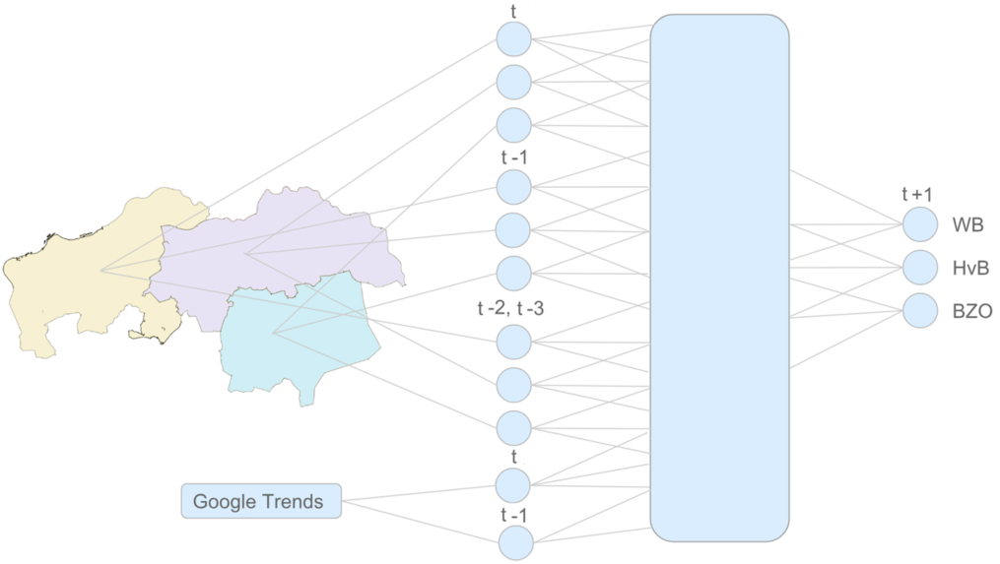

## Analysis

**Disclaimer:** No actual results are shown because they are subject to both corporate and research property. 

I present here the idea of doing spatio-temporal modeling using deep learning. Basically, we use the number of patients of one region 
as a feature to predict the number of patients in the neighboring region. The process of including the spatial information of the patients is done several time steps ago. In addition, we add the search activity of a particular keyword related to the disease as an input to forecast outbreaks. This data is provided by [Google Trends](https://trends.google.com/trends/?geo=US).

 
